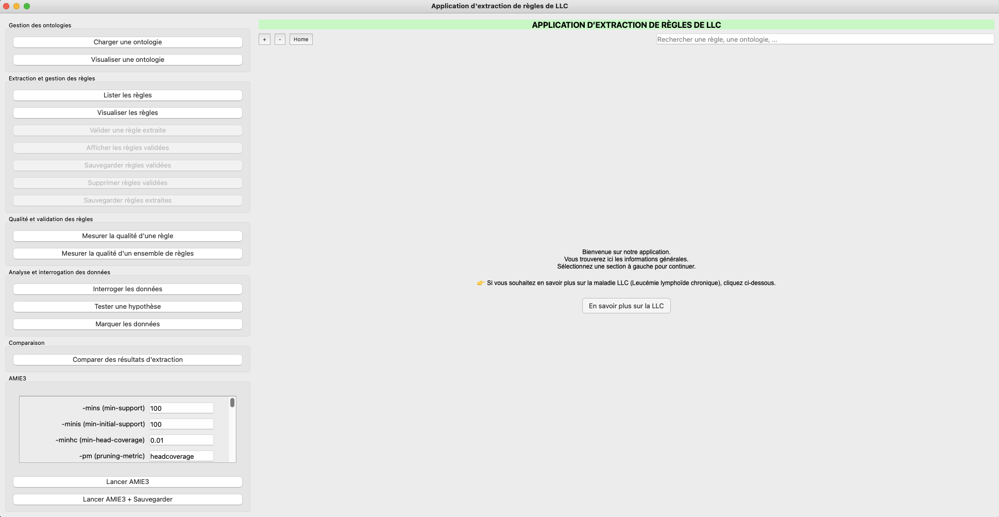
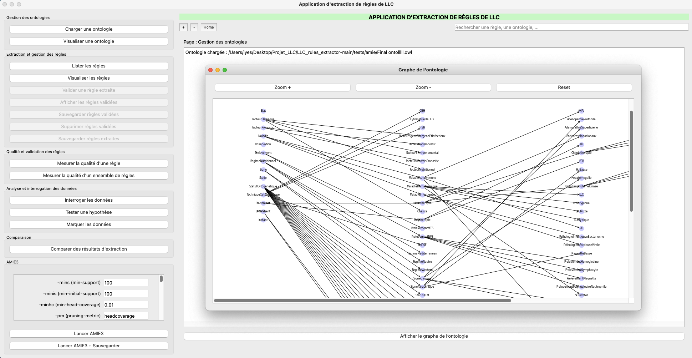
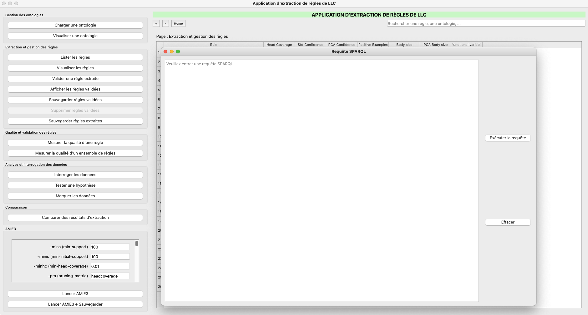
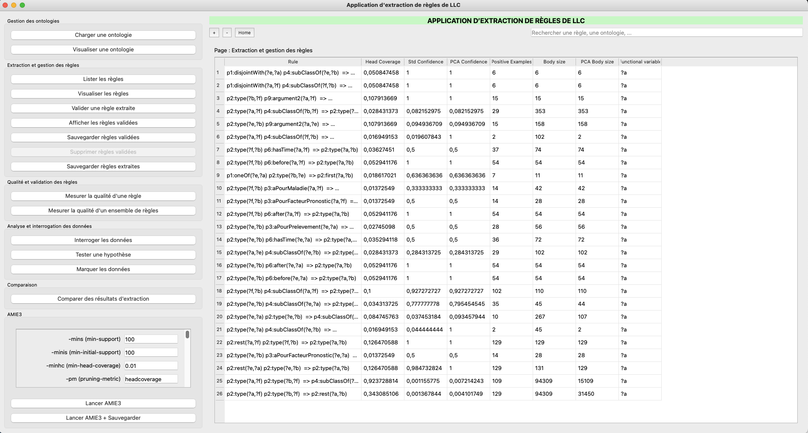
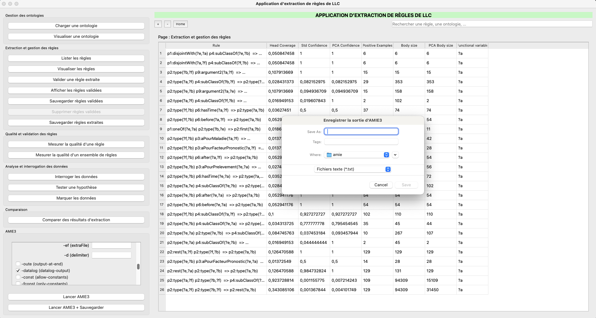
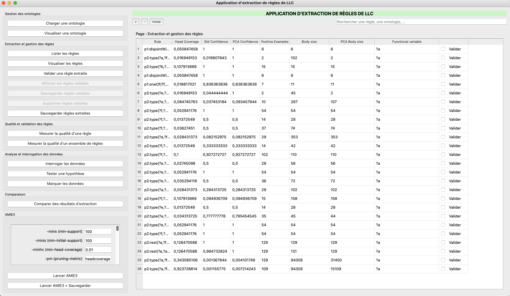
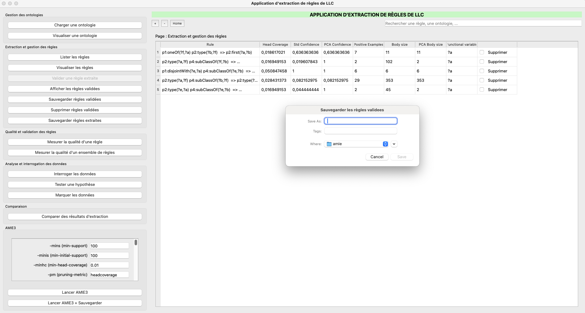
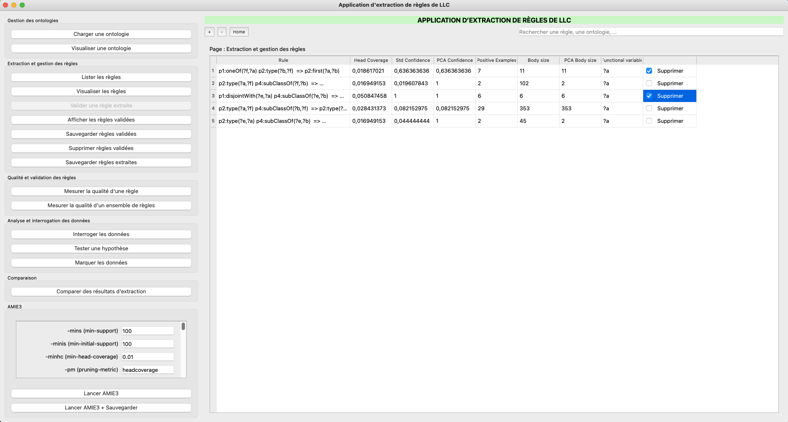
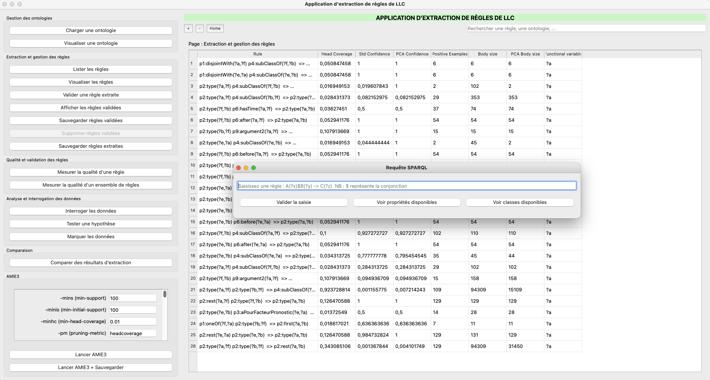
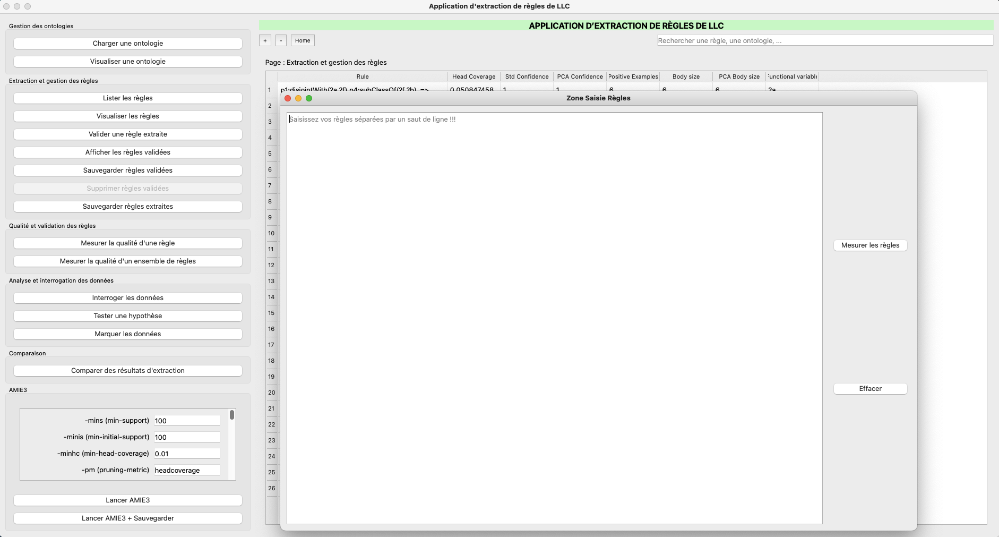

# LLCrulesExtractor : Manuel d'utilisation

**LLCrulesExtractor** est une application interactive en Python permettant d'extraire, visualiser, valider et analyser des règles à partir d'une ontologie RDF/OWL. Basée sur AMIE3, PyQt5 et RDFLib, elle fournit une interface graphique complète pour la manipulation de données sémantiques.

---

##  🚀 Lancement de l'application

Après avoir réalisé ces étapes d'installation : 
   ```bash
   git clone https://github.com/votre-nom/LLC_rules_extractor.git
   cd LLC_rules_extractor
   ```

   ```bash
   pip install -r requirements.txt
   ```

Lancer l’application avec la commande suivante :
   ```bash
   python3 app/main.py
   ```
Vous aurez alors l'affichage suivant : 
  

---
# Fonctionaités


### Charger l'ontologie


Chargez l'ontologie en appuyant sur le bouton **Charger une ontologie**. Chargez de préférence un fichier sous format **OWL**. Vous aurez l'affichage suivant : 
  

---

### Visualiser une ontologie
Pour visualiser une ontologie, appuyez sur le bouton **Visualiser une ontologie**.  
  Vous aurez alors l'affichage suivant :
  

---
### Interroger les données

Assurez vous d'avoir chargé une ontologie avant d'appuyer   sur le bouton **Visualiser une ontologie**. Vous aurez alors l'affichage suivant :

Saisissez votre requête SPARQL sur le champ texte dédiée et Appuyer sur **Executer la requête**.

  


---
### Lancer AMIE3

Assurez vous d'avoir chargé une ontologie avant d'appuyer  **Lancer AMIE3**

NB : Il est possible de spécifier des paramètres avant de lancer AMIE3 a travers la section **AMIE3**

  

---

### Lancer AMIE3 + Sauvegarde

Même principe que la fonctionnalité **Lancer AMIE3** mais en plus d'avoir la possibilité d'exporter les résultats d'extraction dans un fichier. Vous aurez alors l'affichage suivant :
  

---
### Section Extraction et gestion des règles 
Mis à part la fonctionnalité **Visualiser une règle** qui n'est pas implémentée, assurez-vous d'avoir lancé AMIE3 avant de d'utiliser chacune de ces fonctionnalités

#### Valider une règle extraite
Après avoir appuyé **Lister les règles**, vous avez la possibilité de cocher les règles que vous souhaites valider. Une fois coché, Appuyez sur **Valider une règle extraite**.

  

#### Sauvegarder règles validées

Vous pouvez alors afficher les règles extraites avec le bouton **Afficher les règles validées**  :

Il est possible d'exporter ces règles sous format CSV en appuyant sur le bouton **Sauvegarder règles validées** : 
  

#### Supprimer les règles validées 
Il est aussi possible de supprimer des règles validées. Tout d'abord afficher les règles validées en appuyant sur le bouton **Afficher les règles validées** puis cocher sur les règles que vous voulez supprimer et appuyer sur **Supprimer les règles validées**

  

### Mesure de qualité d'une règle
Assurez vous d'avoir chargé une  ontologie au préalable avant de mesurer une règle. Appuyez le bouton **Mesurer la qualité d'une règle**. Vous verez alors une fenêtre avec un champ texte dédiée. Saisissez la règle sur le champ texte en respectant le format prescrit par le texte de substitution et appuyez sur **Valider la saisie** .

  

Vous pouvez si besoin voir les propriétés et les classes contenues en appuyant sur les boutons **Voir propriétés disponibles** et  **Voir classes disponibles**

### Mesure de qualité d'un esnemble de règles
Même principe que la fonctionnalité **Mesure de qualité d'une règle** mais cette fois-ci, il y a la possibilité de mesurer plusieurs règles. Pour cela saisir chaque règle à mesuer sur le champ texte dédié séparée par un saut de ligne et appuyez sur le bouton **Mesurer les règles**.

  

## 🧠 Auteur

Développé par **SupGalilée ING2**
